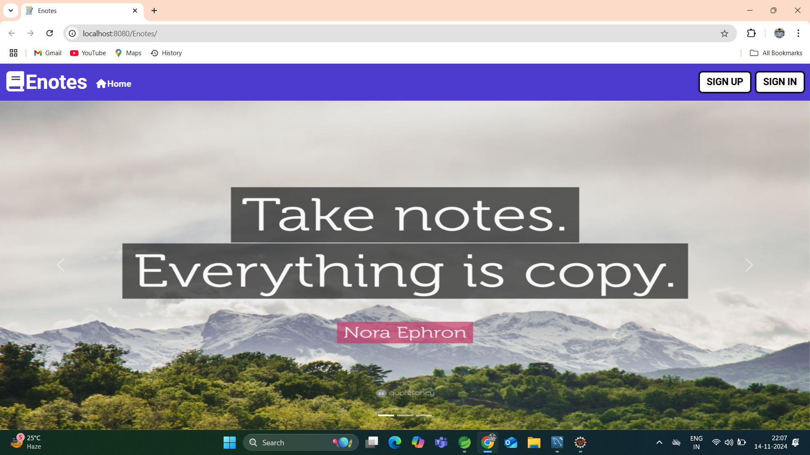
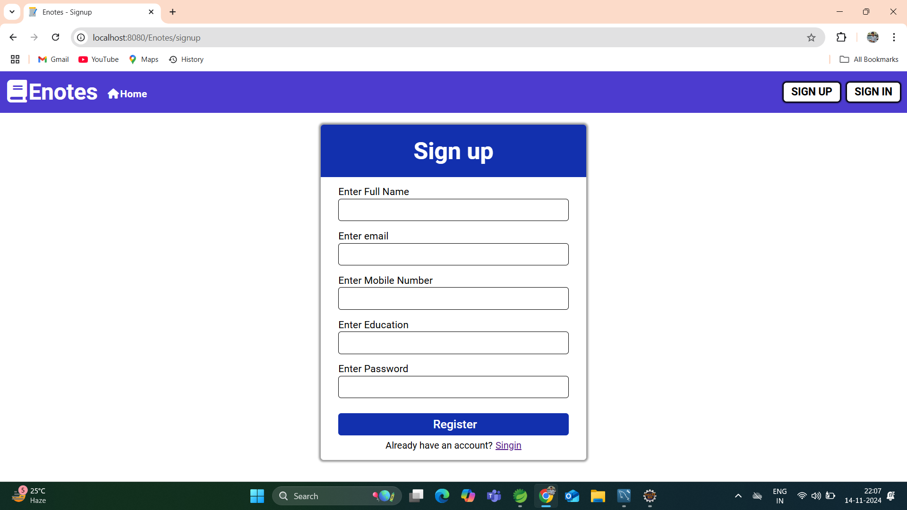
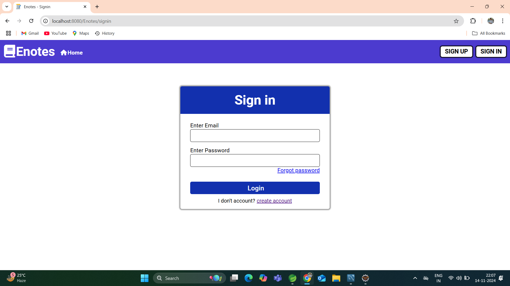
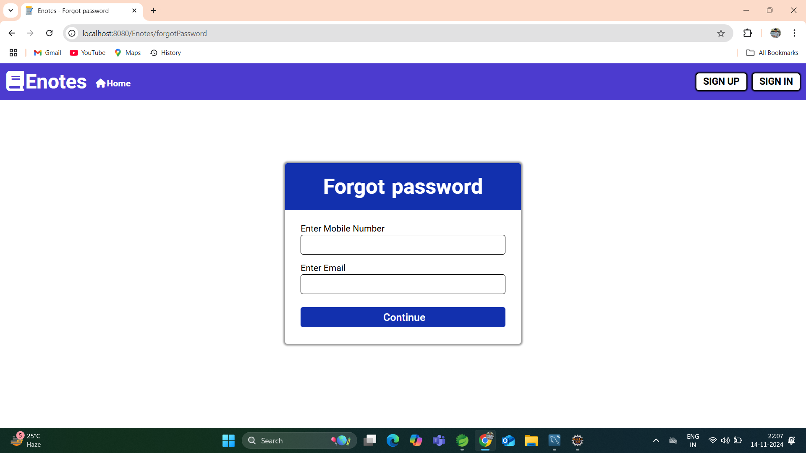
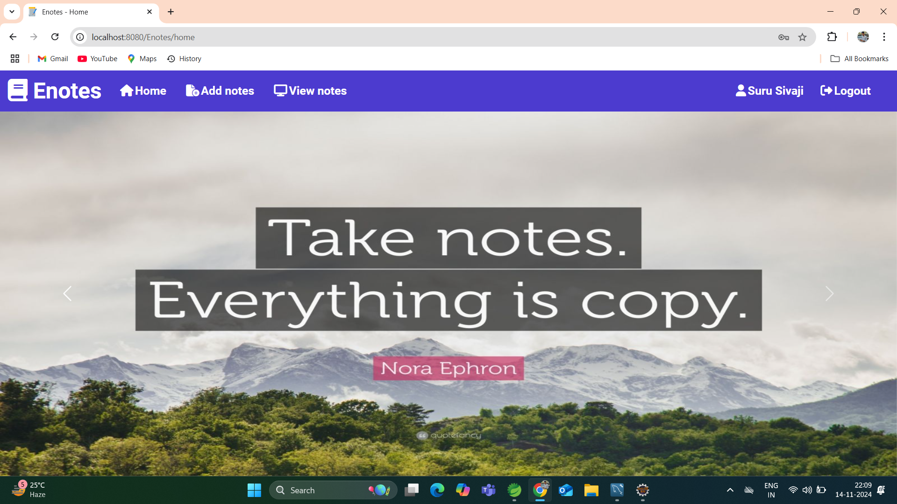
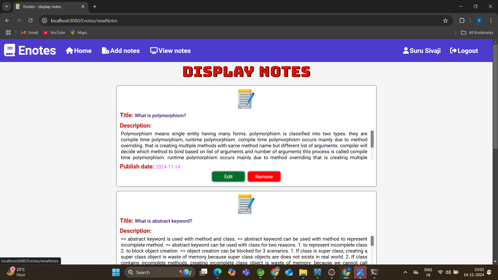
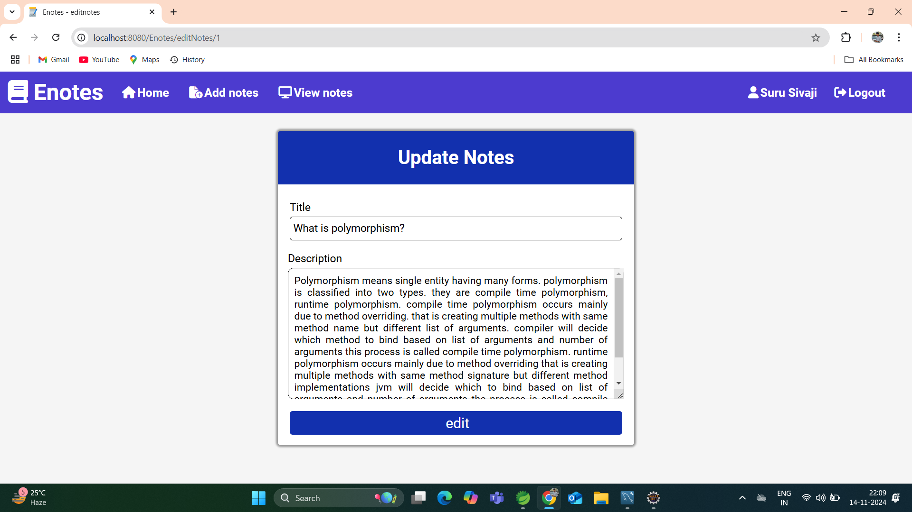
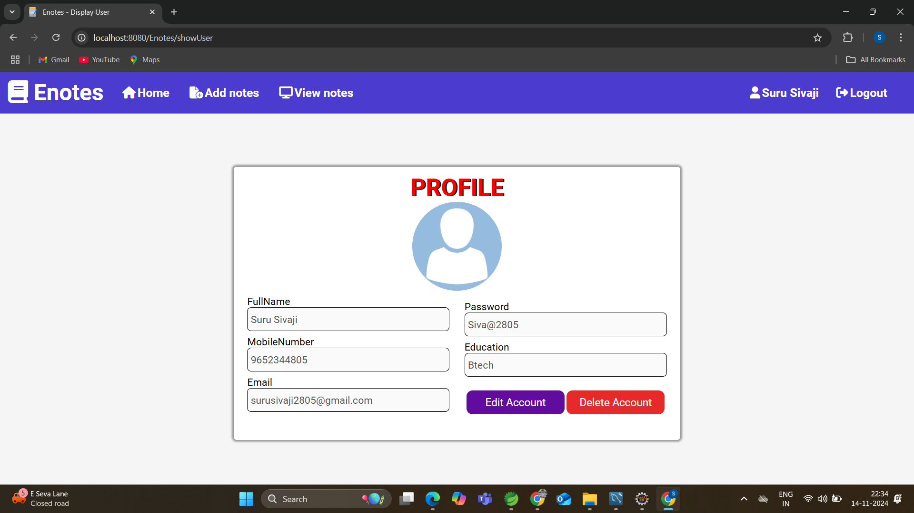
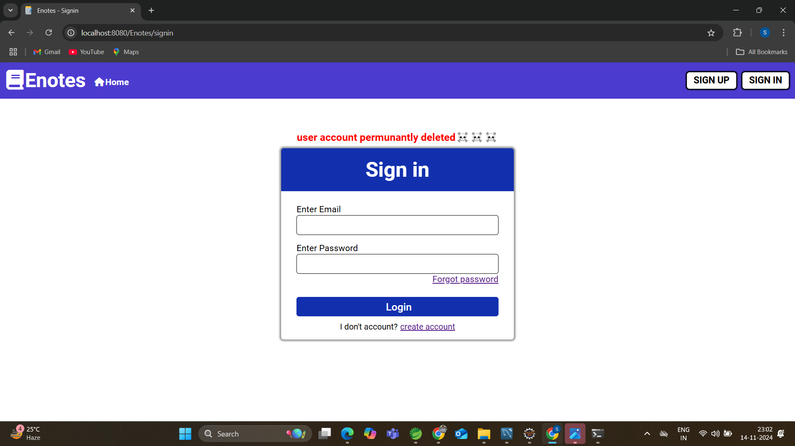
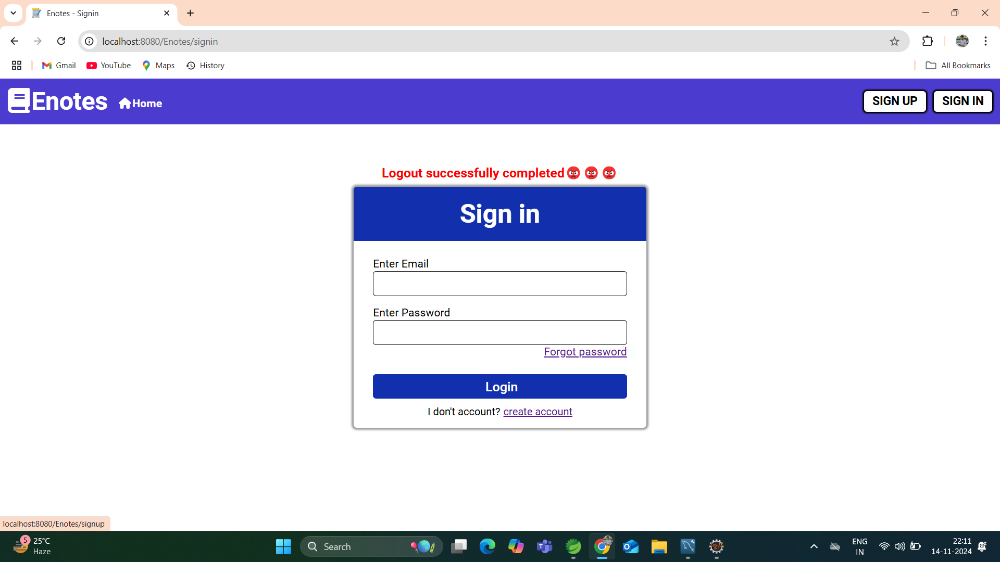

<h1 align="center">📝 eNotes Application</h1>

  <strong>eNotes Application</strong> is a feature-rich note-taking and user management system designed with 
  <strong>Spring MVC</strong>, <strong>Spring Data JPA</strong>, <strong>HTML</strong>, <strong>CSS</strong>, 
  and <strong>JavaScript</strong>. Users can easily manage their notes and account details through this application.

<h2 align="center">📌 Key Features</h2>
<ul>
    <li>🔐 <strong>User Registration & Login</strong>: Easy account creation and secure login process.</li>
    <li>🔑 <strong>Password Recovery</strong>: Password reset using mobile and email verification.</li>
    <li>🗒️ <strong>Notes Management</strong>: Add, update, and delete notes to organize information.</li>
    <li>👤 <strong>User Profile Management</strong>: View, update, and delete user profile information.</li>
    <li>💻 <strong>JavaScript Validations</strong>: Ensures data integrity across all forms.</li>
    <li>🔄 <strong>Servlet Chaining</strong>: Improved session control through <code>redirect method</code>.</li>
</ul>

<h2 align="center">🏗️ Project Architecture</h2>

The application is organized in a <strong>four-layer architecture</strong> for clean and efficient code management.

<h3>1. Model Layer</h3>

This layer includes entity classes representing database tables:

<ul>
    <li><strong>User Entity</strong>: Contains fields for storing user details.</li>
    <li><strong>Notes Entity</strong>: Stores individual notes with a <strong>Many-to-One relationship</strong> with users.</li>
</ul>

<h3>2. Controller Layer</h3>

Manages <strong>URL mappings</strong>, directs to specific JSP pages, and handles HTTP requests and responses.

<h3>3. Service Layer</h3>

Executes business logic for the application's core functionalities, like managing user and note operations.

<h3>4. Repository Layer</h3>

Includes repository interfaces for interacting with the database to perform CRUD operations on entities.

<h2 align="center">🚀 Core Functionalities</h2>
<ul>
    <li>🔐 <strong>User Registration</strong>: Create a new user account with basic details.</li>
    <li>🔑 <strong>User Login</strong>: Login securely to access the application.</li>
    <li>❓ <strong>Forgot Password</strong>: Reset password using mobile number and email validation.</li>
    <li>🗒️ <strong>Add Notes</strong>: Add new notes for keeping track of tasks or information.</li>
    <li>✏️ <strong>Update Notes</strong>: Modify existing notes to keep information up-to-date.</li>
    <li>❌ <strong>Delete Notes</strong>: Remove notes that are no longer needed.</li>
    <li>👤 <strong>View Profile</strong>: View personal information after logging in.</li>
    <li>✏️ <strong>Update Profile</strong>: Update personal information to keep it current.</li>
    <li>🗑️ <strong>Delete Account</strong>: Permanently delete the user account if no longer needed.</li>
</ul>

<h2 align="center">⚙️ Technology Stack</h2>
<ul>
    <li><strong>Backend</strong>: Spring MVC, Spring Data JPA</li>
    <li><strong>Frontend</strong>: HTML, CSS, JavaScript</li>
    <li><strong>Session Management</strong>: Java Session objects to provide dynamic feedback to users</li>
</ul>

<h2 align="center">📷 Screenshots</h2>

Here are some screenshots showcasing the key functionalities of the <strong>eNotes Application</strong>:

    

    
Index Page

    

    
Registration

    

    
Login

    

    
forgot password

    

    
forgot password1

    

    
forgot password

    

    
add notes

    

    
view notes

    

    
edit notes

    

    
viewprofile

    

    
update profile

    

    
delete account

    

    
logout

<h2 align="center">📂 Getting Started</h2>

Follow these steps to set up the application on your local machine:

<ol>
    <li>Clone the repository:</li>
    <pre><code>git clone https://github.com/yourusername/enotes-application.git</code></pre>
    <li>Navigate to the project directory:</li>
    <pre><code>cd enotes-application</code></pre>
    <li>Build the project using Maven:</li>
    <pre><code>mvn clean install</code></pre>
    <li>Run the application:</li>
    <pre><code>mvn spring-boot:run</code></pre>
    <li>Access the application at <code>http://localhost:8080</code></li>
</ol>

<h2 align="center">📄 License</h2>

This project is licensed under the MIT License. See the <code>LICENSE</code> file for details.

<h2 align="center">🤝 Contributing</h2>

Contributions are welcome! Please fork this repository and submit a pull request for any improvements.

