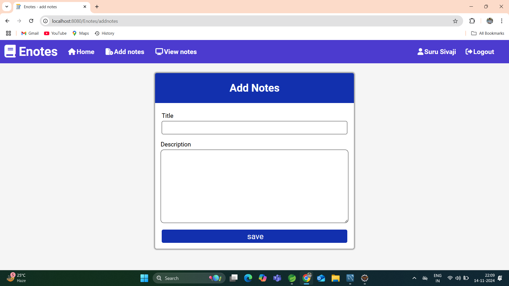

<h1 align="center">📝 ENotes Application</h1>

  <strong>ENotes Application</strong> is a feature-rich note-taking and user management system built using 
  <strong>Spring MVC</strong>, <strong>Spring Data JPA</strong>, <strong>HTML</strong>, <strong>CSS</strong>, 
  and <strong>JavaScript</strong>. This application empowers users to easily manage their notes and account details.

<h2 align="center">📌 Key Features</h2>

  The application provides users with powerful tools for note-taking and account management:

  <ul>
    <li>🔐 <strong>User Registration & Login</strong>: Easy and secure account creation and login process.</li>
    <li>🔑 <strong>Password Recovery</strong>: Reset passwords with email and mobile number verification.</li>
    <li>🗒️ <strong>Notes Management</strong>: Organize information by adding, updating, and deleting notes.</li>
    <li>👤 <strong>User Profile Management</strong>: View, update, and delete profile information.</li>
    <li>💻 <strong>JavaScript Validations</strong>: Ensures data integrity across all forms.</li>
    <li>🔄 <strong>Servlet Chaining</strong>: Enhanced session control through <code>sendRedirect</code> for redirections.</li>
  </ul>

<h2 align="center">🏗️ Project Architecture</h2>

  Built using a clean and maintainable <strong>four-layer architecture</strong> for optimal code organization.

  <h3>1. Model Layer</h3>
  
Contains entity classes representing the database tables:

  <ul>
    <li><strong>User Entity</strong>: Stores user details.</li>
    <li><strong>Notes Entity</strong>: Stores individual notes, with a <strong>Many-to-One</strong> relationship to users.</li>
  </ul>

  <h3>2. Controller Layer</h3>
  
Handles <strong>URL mappings</strong>, routes to JSP pages, and manages HTTP requests and responses.

  <h3>3. Service Layer</h3>
  
Processes core business logic, including operations for managing users and notes.

  <h3>4. Repository Layer</h3>
  
Defines repository interfaces for CRUD operations on database entities.

<h2 align="center">🚀 Core Functionalities</h2>

  <ul>
    <li>🔐 <strong>User Registration</strong>: Create accounts with basic user details.</li>
    <li>🔑 <strong>User Login</strong>: Securely access the application.</li>
    <li>❓ <strong>Forgot Password</strong>: Reset passwords using mobile and email validation.</li>
    <li>🗒️ <strong>Add Notes</strong>: Easily add notes for personal organization.</li>
    <li>✏️ <strong>Update Notes</strong>: Modify existing notes as needed.</li>
    <li>❌ <strong>Delete Notes</strong>: Remove notes that are no longer relevant.</li>
    <li>👤 <strong>View Profile</strong>: View personal information after login.</li>
    <li>✏️ <strong>Update Profile</strong>: Update profile information to keep it current.</li>
    <li>🗑️ <strong>Delete Account</strong>: Permanently delete accounts if desired.</li>
  </ul>

<h2 align="center">⚙️ Technology Stack</h2>

  <ul>
    <li><strong>Backend</strong>: Spring MVC, Spring Data JPA</li>
    <li><strong>Frontend</strong>: HTML, CSS, JavaScript</li>
     <li><strong>Database</strong>: MySql</li>
    <li><strong>Session Management</strong>: Java session objects for dynamic user feedback</li>
  </ul>

<h2 align="center">📷 Screenshots</h2>

  

    
    
Index Page

  

  

    
    
Registration

  

  

    
    
Login

  

  

    
    
Forgot Password

  

  

    
    
Forgot Password Verification

  

  

    
    
Home Page

  

  

    
    
Add Notes

  

  

    
    
View Notes

  

  

    
    
Update Notes

  

  

    
    
View Profile

  

  

    
    
Update Profile

  

  

    
    
Delete Account

  

  

    
    
Logout

  

